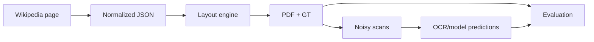
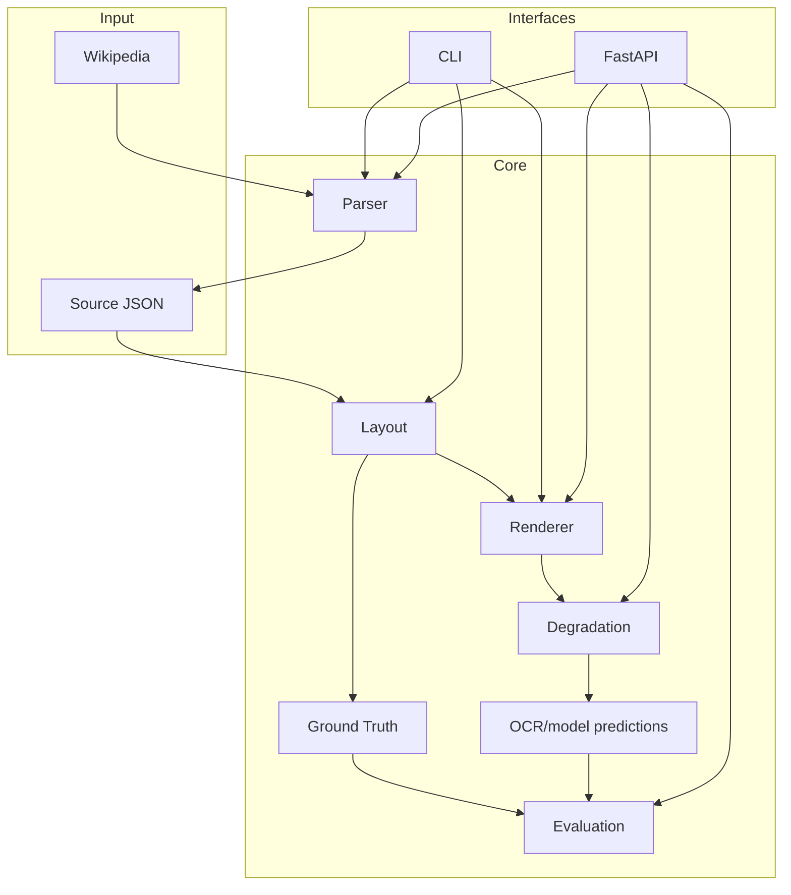

# PolyDocBench

Synthetic document generation, rendering, degradation, and evaluation toolkit for OCR, document layout analysis, and reading-order research.

[](https://github.com/vorobev-danila/PolyDocBench/actions/workflows/tests.yml)


[Overview](#overview) |
[Features](#features) |
[Architecture](#architecture) |
[Quick Start](#quick-start) |
[Docker](#docker) |
[Tutorials](#tutorials) |
[Contributing](#contributing)

PolyDocBench turns web-scale document content into controlled synthetic PDFs, ground-truth annotations, noisy scan variants, and evaluation inputs. It is built for researchers and engineers who need reproducible OCR and document-understanding experiments without manually annotating every page.

## Overview

PolyDocBench covers the core research loop for document AI benchmarks:



The project is useful for:

- OCR and document AI research;
- layout analysis and reading-order experiments;
- synthetic document generation;
- formula, image, and text rendering experiments;
- reproducible benchmark pipelines.

## Features

- Multilingual Wikipedia parsing.
- Template-based synthetic document layout.
- PDF rendering with text, images, formulas, and debug bounding boxes.
- Ground-truth export with stable IDs, bboxes, and reading order.
- Text justification and centered graphical elements.
- Scan-like degradation profiles: `light_scan`, `medium_scan`, `heavy_scan`.
- OCR quality and reading-order evaluation utilities.
- CLI and FastAPI interfaces.
- `uv`-first developer workflow.

## Architecture



More details: [Architecture Tutorial](tutorials/architecture.md).

## Quick Start

```powershell
git clone https://github.com/vorobev-danila/PolyDocBench.git
cd PolyDocBench
uv sync
uv pip install -e ".[api,degradation,dev]"
```

Render a bundled example:

```powershell
uv run python -m polydocbench render examples\wiki_formulas_isl.json -o outputs\wiki_formulas_isl.pdf --template simple_article
```

Start the API:

```powershell
uv run python -m uvicorn polydocbench.api.app:app --reload --host 127.0.0.1 --port 8000
```

Open:

```text
http://127.0.0.1:8000/docs
```

Full setup guide: [Installation Tutorial](tutorials/installation.md).

## Docker

Build and run the API with Docker Compose:

```powershell
docker compose up --build
```

Open:

```text
http://127.0.0.1:8000/docs
```

Generated files are written to `outputs/` through a mounted volume.

Docker guide: [Docker Tutorial](tutorials/docker.md).

## Tutorials

The detailed documentation is split into focused tutorials:

| Tutorial | What it covers |
| --- | --- |
| [Installation](tutorials/installation.md) | Prerequisites, `uv` setup, extras, Docker note |
| [Docker](tutorials/docker.md) | Build image, run API, execute CLI in a container |
| [CLI Workflow](tutorials/cli-workflow.md) | Parse, render, debug bboxes, noisy scans |
| [FastAPI Workflow](tutorials/fastapi-workflow.md) | API startup, endpoints, request examples |
| [Architecture](tutorials/architecture.md) | Components, data flow, module responsibilities |
| [Data Format](tutorials/data-format.md) | Source JSON, GT JSON, schema versions |
| [Configuration](tutorials/configuration.md) | Layout templates, render config, JSON snippets |
| [Development](tutorials/development.md) | Tests, CI, project structure, contribution flow |

## Project Structure

```text
polydocbench/
  api/           # FastAPI application and workflow services
  degradation/   # PDF-to-scan rendering and noise profiles
  document/      # Shared document model and normalization
  eval/          # OCR quality, geometry, and ordering metrics
  gt/            # Ground-truth export, schema, validation, reading order
  layout/        # Layout engine, line breaking, placement, templates
  render/        # PDF rendering, debug overlays, element renderers
  sources/       # Source adapters, currently Wikipedia
  cli.py         # Command-line interface

configs/         # Layout and render configuration
examples/        # Example source JSON files
notebooks/       # Research notebooks and experiments
scripts/         # Small manual workflows
tests/           # Pytest suite
tutorials/       # Extended user and developer guides
outputs/         # Generated artifacts, ignored by git
Dockerfile       # Container image for API and CLI usage
docker-compose.yml
```

## Development Workflow

```powershell
uv pip install -e ".[api,degradation,formula,dev]"
uv run python -m pytest -q -p no:cacheprovider
```

CI runs on every push and pull request to `main` using GitHub Actions.

Developer guide: [Development Tutorial](tutorials/development.md).

## Contributing

Contributions are welcome around new sources, richer templates, rendering quality, degradation profiles, OCR metrics, API/UI workflows, and documentation.

Suggested flow:

1. Fork the repository.
2. Create a feature branch.
3. Add or update tests.
4. Run the test suite locally.
5. Open a pull request with a concise description and example output.

## License

No license file is currently committed. Add a `LICENSE` file before distributing or reusing the project as a public open-source package.
