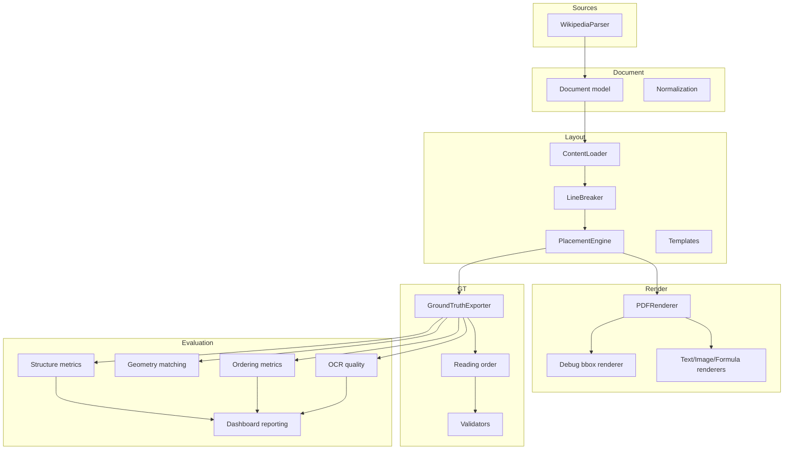

# Architecture

PolyDocBench is built around a modular document-generation and evaluation pipeline.

## Data Flow

## Components

## Module Responsibilities

| Module | Responsibility |
| --- | --- |
| `polydocbench.sources` | Source adapters, currently Wikipedia parsing |
| `polydocbench.document` | Shared document model and normalization |
| `polydocbench.layout` | Line breaking, typography, placement, templates |
| `polydocbench.render` | PDF rendering and debug overlays |
| `polydocbench.gt` | Ground-truth export, schema, validation, reading order |
| `polydocbench.noise` | PDF-to-image conversion and scan noise profiles |
| `polydocbench.eval` | Tesseract quality, semantic-block ordering, Docling structure evaluation, matching, dashboard reporting |
| `polydocbench.api` | FastAPI workflows over the pipeline |
